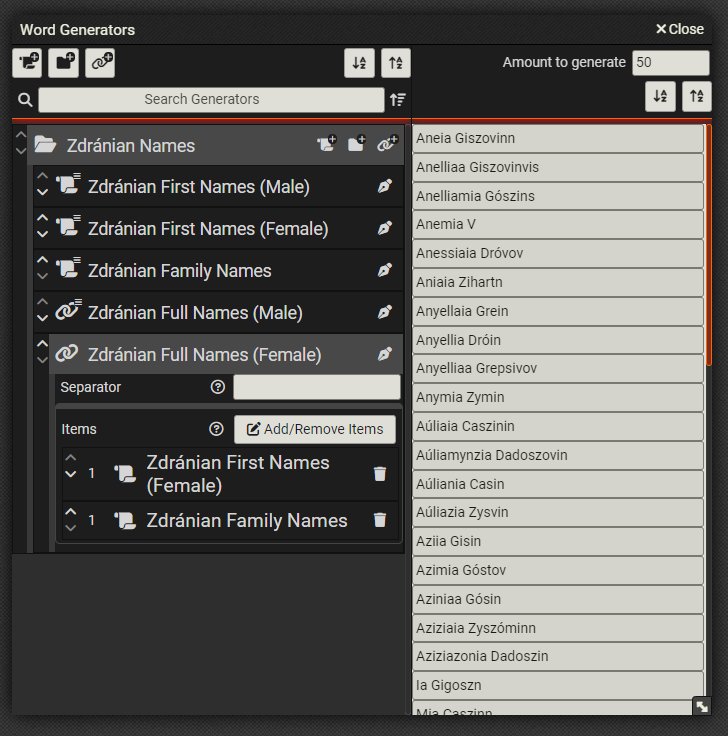

# Text Generator
This module for FoundryVTT adds a means of randomly generating words, names or even sentences, based on a given sample set. 



## Usage (Macro)
This section explains how to make use of the module as it comes out of the box. 

1. Add a new Macro of type `script`. 
2. Paste the following code snippet and save: `new WgApplication().render(true);`
3. That's it! When executing the macro, the word generator dialog should now pop up!

## Usage (Code)
This section explains how to incorporate the business-logic of the word generator. This section is useful to those who'd like to use the generator, but with their own user interface. 

```JS
const sampleSet = [
  "Bob",
  "Billy",
  "Bowley",
  "Bond",
  "Abigail",
  "Abe",
  "Albert",
];
// The mandatory constructor parameter-object properties are: 
// `sampleSet`, `targetLengthMin`, `targetLengthMax` and `sequencingStrategy`
const generator = new WordGenerator({
  // A string array of the words to base word generation on. 
  sampleSet: sampleSet,
  // Currently, two sequencing strategies come out of the box:
  // CharDepthSequencingStrategy - which uses a hard-set length to cut sequences to. 
  // DelimiterSequencingStrategy - which uses a delimiter/separator string to cut sequences. 
  sequencingStrategy: new CharDepthSequencingStrategy(2),
  // This is the minimum length of generated words. No guarantees, though. The sequencing and spelling strategies 
  // may also affect the generated word's length. 
  targetLengthMin: 4,
  // This is the maximum length of generated words. No guarantees, though. The sequencing and spelling strategies 
  // may also affect the generated word's length. 
  targetLengthMax: 10,
  // An optional randomization seed, in case you want the same result sets across multiple instances of the generator. 
  seed: undefined,
  // Currently, only one spelling strategy comes out of the box: 
  // BeginningCapitalsSpellingStrategy - which capitalizes the first letter of every generated word. 
  spellingStrategy: new BeginningCapitalsSpellingStrategy(),
  // There are three ending pick modes: 
  // NONE: Ending sequences are not considered at all and may even appear in the middle of a built word. 
  //   This option provides no benefits, but also doesn't hinder variance. This option is a good choice 
  //   when word endings don't matter. 
  // RANDOM: An ending sequence is picked entirely at random, from the set of ending sequences. 
  //   This option provides great variance and good cohesion. A reasonable default. 
  // FOLLOW_BRANCH: Branches will be followed until eventually reaching an ending sequence, which is then picked. 
  //   This option provides the greatest cohesion, but lowest variance and may also cause unique word generation to fail, 
  //   if the example sample set is too small. 
  endingPickMode: ENDING_PICK_MODES.RANDOM,
  // Entropy is a value from 0 to 1 (inclusive), which represents the chance that a word will contain sequences picked entirely at random. Greater variance, but much lower cohesion. 
  entropy: 0.0,
  // The starting entropy is a value from 0 to 1 (inclusive), which represents the chance that a word will 
  // start with a sequence picked entirely at random, from the set of starting sequences. 
  // Increasing this number increases the frequency of the less common starts. 
  entropyStart: 0.0,
  // The middle entropy is a value from 0 to 1 (inclusive), which represents the chance that a word will 
  // contain sequences picked entirely at random. 
  // Increasing this number increases variance greatly, but also reduces cohesion greatly. 
  entropyMiddle: 0.0,
  // The ending entropy is a value from 0 to 1 (inclusive), which represents the chance that a word will 
  // end with a sequence picked entirely at random, from the set of ending sequences. 
  // Increasing this number increases variance, but also reduces cohesion. 
  entropyEnd: 0.0,
});
// Generates 10 words. 
const generatedWords = generator.generate(10);
```

## Extending Functionality
The generator was designed with easy extensibility in mind, for when greater control over its behavior is needed. 

There are currently two intended ways to extend functionality:
1. Defining new sequencing strategies. 
2. Defining new spelling strategies. 

Both of these are a bit quirky, in that a type that represents a sequencing/spelling strategy acts as both its abstract **definition** and its concrete **implementation**. 

They must both implement the following methods, which act as the 'definition' part of the type: 
* `getDefinitionID`
* `newInstanceWithArgs`

Additionally, **sequencing** strategies must implement:
* `getSequencesOfSample`
* `getSettings`

Additionally, **spelling** strategies must implement:
* `apply`
* `getSettings`

For a description of what these methods are expected to do and return, see the documentation of: 
* [`AbstractSequencingStrategy`](script/generator/sequencing/abstract-sequencing-strategy.mjs)
* [`AbstractSpellingStrategy`](script/generator/postprocessing/abstract-spelling-strategy.mjs)

### Sequencing Strategy
A sequencing strategy is the piece of logic that 'cuts' a given sample into sequences. A sequence can be as short as a single character or as long as several sentences. 

All sequencing strategies must inherit from `AbstractSequencingStrategy` or at least implement all its members. 

An example implementation is the `CharDepthSequencingStrategy`, which creates sequences of a defined length, based on character-count. 

#### Custom Sequencing Strategy
Once you've defined your custom sequencing strategy, you must register it with the word generator application, so that it may be selectable in the UI. 

The following code must be run **once** for every custom sequencing strategy you've defined. 

```JS
WgApplication.registeredSequencingStrategies.register(new myCustomSequencingStrategy());
```

An exception is thrown, if you attempt to register the same type of sequencing strategy more than once. When registering your custom type from a macro script, you can simply 'catch' and disregard the exception: 

```JS
try {
WgApplication.registeredSequencingStrategies.register(new myCustomSequencingStrategy());
} catch (e) { /* ignore */ }

```

### Spelling Strategy
A spelling strategy is a piece of logic to apply to generated words, in order to enforce some kind of spelling. 

All spelling strategies must inherit from `AbstractSpellingStrategy` or at least implement all its members. 

An example implementation is the `BeginningCapitalsSpellingStrategy`, which capitalizes the first letter of every word. 

#### Custom Spelling Strategy
Once you've defined your custom spelling strategy, you must register it with the word generator application, so that it may be selectable in the UI. 

The following code must be run **once** for every custom spelling strategy you've defined. 

```JS
WgApplication.registeredSpellingStrategies.register(new myCustomSpellingStrategy());
```

An exception is thrown, if you attempt to register the same type of spelling strategy more than once. When registering your custom type from a macro script, you can simply 'catch' and disregard the exception: 

```JS
try {
WgApplication.registeredSpellingStrategies.register(new myCustomSpellingStrategy());
} catch (e) { /* ignore */ }

```

## No Dependencies?
No npm packages or other dependencies have been included. This was at least partly a deliberate decision: 
1. There is no native support for npm packages in FoundryVTT modules. 
1. Bundling the dependencies would be possible, but requires the significant overhead and experience of setting up a bundler. 
1. Dependencies always introduce another potential point of failure. Should any one of the potentially hundreds of indirect dependencies cause problems, the overhead of troubleshooting would be much too great. This software is simple enough to not need the potential for dependency-hell. 
